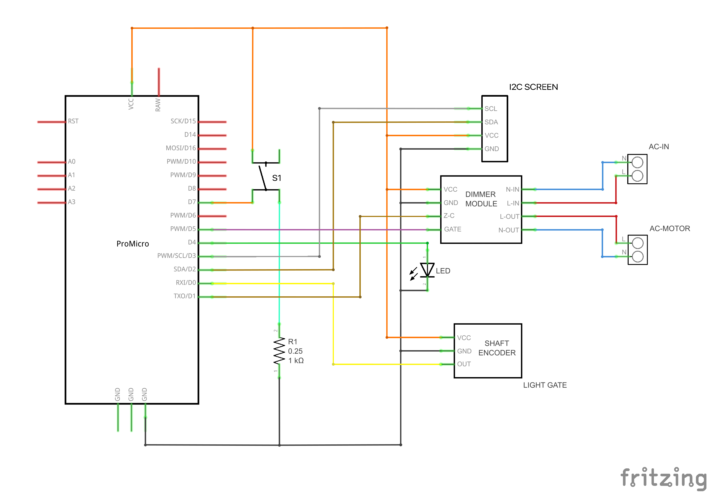
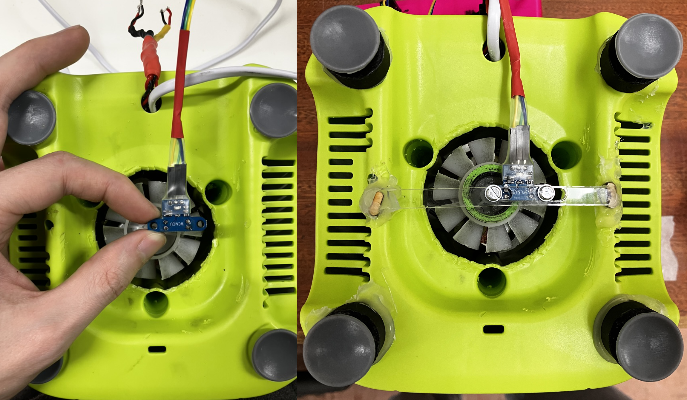
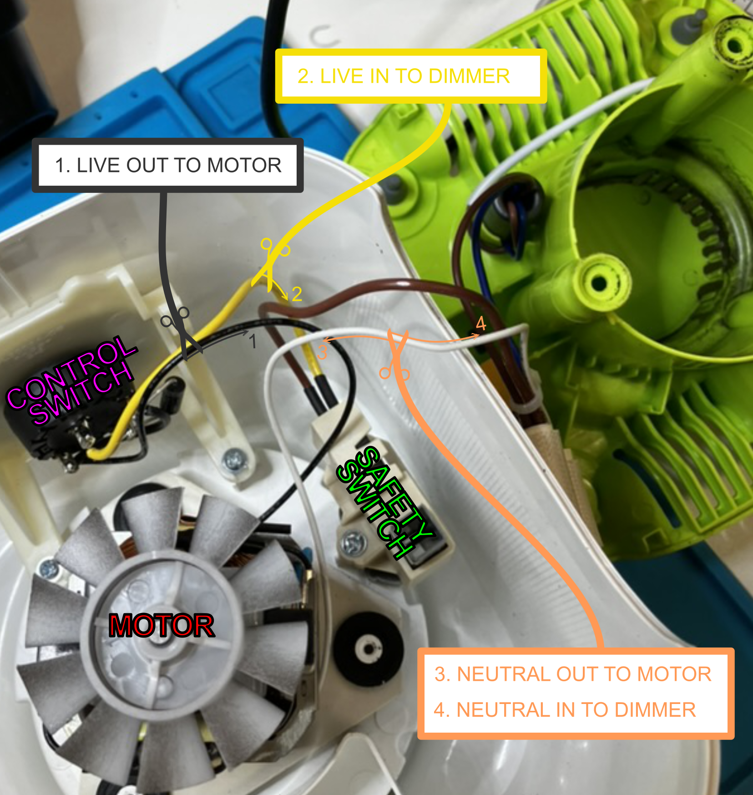
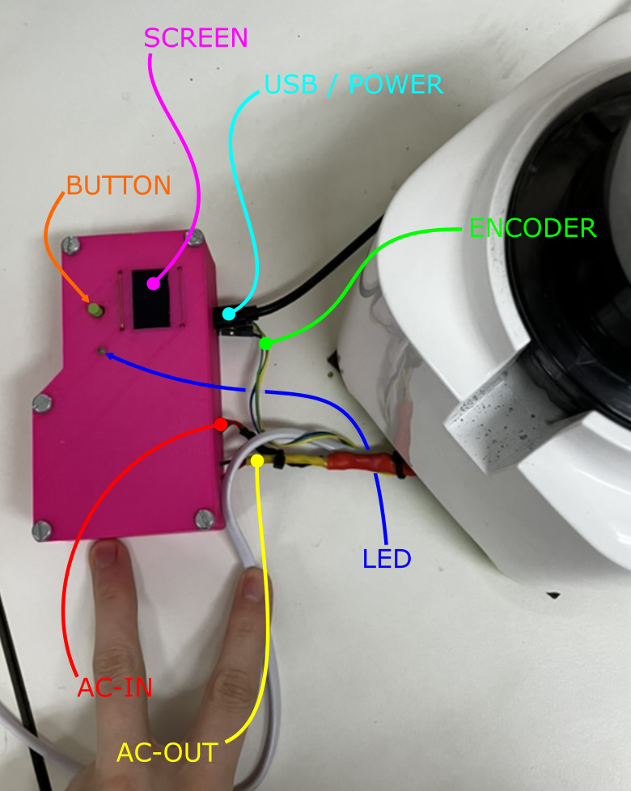
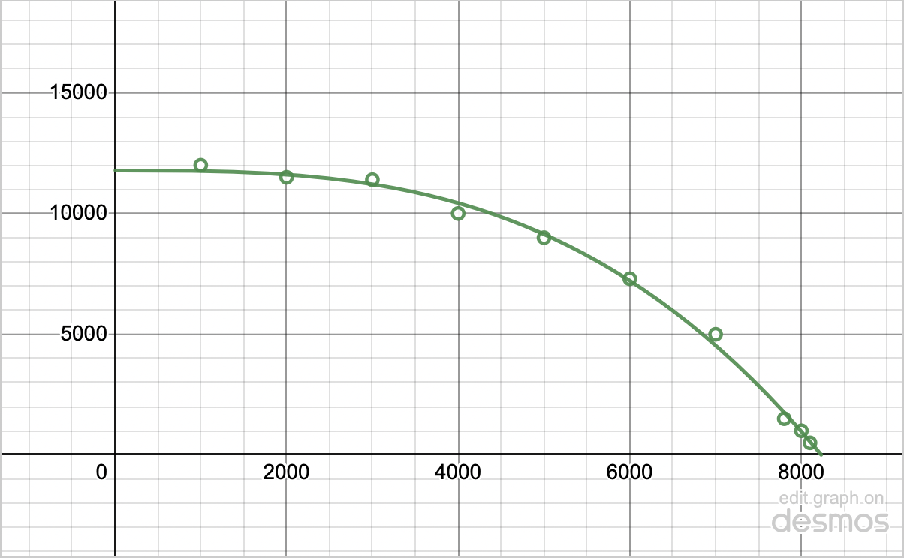
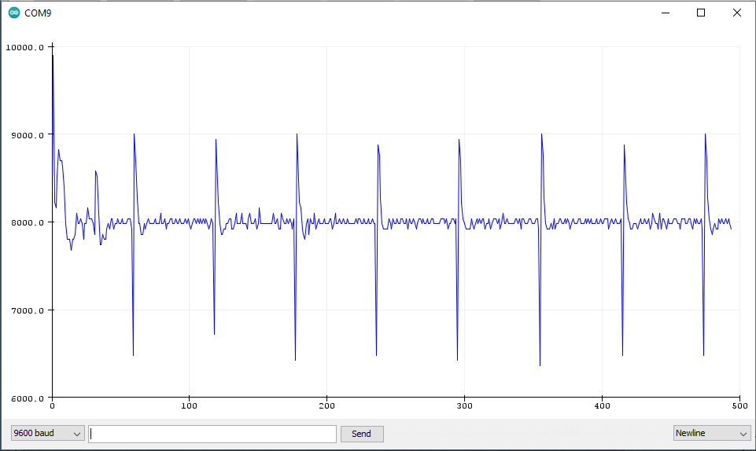

# PID Blender
_Blender with PID Speed Control, Build Notes._


_From right to left, V1: Servo-Operated Dimmer Blender, V2: Uncontrolled Dimmer Blender, Version 3: the PID Blender._

### Background \& Motivation

For my current work, I needed a blender that could be operated with good control over the exact impeller speed. Initially, I wired dimmer switch into a typical household blender, but found that it was incredibly difficult to maintain the speed accurately and repeatably, especially at low speeds (< $6000$ $rpm$). To improve performance, it was clear what was required was a system that could control the speed dynamically.

The blenders I have been controlling range between $600$ $W$ to $2$ $kW$ peak power, which they can sustain for a maximum of $\approx 1$ $min$ before they get dangerously hot (and melt-y). Some come with automatic sensors to detect when they are overheating and shut-off automatically to save the motor. From my testing, I recommend following the manufacturer's recommendations alternating running it for $1$ $min$ **ON** with a subsequent minimum of $1$ $min$ **OFF** to allow it to cool down.

### Disclaimer!

Playing with AC is _incredibly_ dangerous. Make sure to take all precautions when making modifications and ensure everything is unplugged and grounded.

### Operating Principles

I find that this project has used nearly all the interrupts with this Arduino. It would also be nice if there was some sort of 5V power supply from the blender ([Which is a feature on some of the more pricey models](https://www.amazon.co.uk/Smoothie-AMZCHEF-Commercial-Container-25000RPM/dp/B08CKTB6Z4/ref=sr_1_6?crid=3VN5BPYJ9QWY7&keywords=2000w%2Bblender&qid=1670790024&s=kitchen&sprefix=2000W%2B%2Ckitchen%2C72&sr=1-6&th=1), [or the knock-off alternative](https://www.homgeek.com/p-h22259uk.html), they also have a built-in hall effect sensor).



This project combines [PID closed loop control](https://www.norwegiancreations.com/2016/08/the-seesaw-part-2-basic-pid-theory-and-arduino-implementation/) with [phase-angle control](https://electricalacademia.com/electronics/scr-thyristor-phase-control-circuit/) of AC signals.

##### Dimmer Module

Passing a signal to the **GATE** pin of the dimmer module passes directly (through an isolating optocoupler) to the gate pin of the TRIAC in the module. 
As the AC signal dips or rises above 0, the Zero Cross signal from the Dimmer module blips high (**Z-C** pin) for a brief period of time.

**L-OUT** then conducts depending on if the TRIAC has been signaled.

##### Shaft Encoder (Photo-interrupter)

**OUT** is high when the light's path is unbroken. When the shaft of the motor is spinning, we repeatedly interrupt the path with an opaque material to recieve a pulsed signal analogous to the motors' current speed.

##### Proportional, Integral \& Differential Control

This control method is favoured for its simplicity, as it only requires tuning a couple of values to control complex signals. A guide for qualitatively tuning PID systems for a good control response can be found [here](https://www.thorlabs.com/newgrouppage9.cfm?objectgroup_id=9013#:~:text=To%20tune%20your%20PID%20controller,to%20roughly%20half%20this%20value.).


## Bill of Materials

|Name               |QTY|Description                           |
|:------------------|:-:|:-------------------------------------|
|[Blender](https://www.kenwoodworld.com/en-gb/blend-x-compact-blp31-d0wg/p/BLP31.D0WG)|1  |600W Kenwood BLP.D0WG|
|[Arduino](https://www.sparkfun.com/products/12640)|1  |Pro Micro (Leonardo based, ATmega32U4)|
|[Dimmer Module](https://www.ebay.co.uk/itm/115506248106?mkevt=1&mkcid=1&mkrid=710-53481-19255-0&campid=5338364432&toolid=11000&_ul=UK&customid=EAIaIQobChMIq-2ml5Py-wIVS57tCh3bXgB5EAQYECABEgJU6vD_BwE&gclid=EAIaIQobChMIq-2ml5Py-wIVS57tCh3bXgB5EAQYECABEgJU6vD_BwE)|1  |Dimmer circuit with optocoupler to isolate live AC from the arduino.|
|Button             |1  |To stop, start and restart processing.|
|LED                |1  |Quick indicator for displaying status.|
|[Light Encoder](https://thepihut.com/products/photo-interrupter-sensor)|1  |For measuring speed, more accurately known as a photo-interrupt sensor. You could easily swap this out with a hall effect sensor.|
|[0.96" OLED I2C Screen](https://www.amazon.co.uk/Display-ARCELI-Characters-Compatible-Raspberry-blue/dp/B09P8DDXZ8/ref=asc_df_B09P8DDXZ8/?tag=googshopuk-21&linkCode=df0&hvadid=570428249641&hvpos=&hvnetw=g&hvrand=12641479531537806638&hvpone=&hvptwo=&hvqmt=&hvdev=c&hvdvcmdl=&hvlocint=&hvlocphy=9045466&hvtargid=pla-1639324494446&psc=1)|1  |For a more detailed readout of the current status.|
|M3 Screws|6  |10 mm long, for holding down the Dimmer and Arduino.|
|M3 Low Profile Screws + Nuts|2  |10 mm long, for holding the Encoder in place.|
|M2.5 Screws + Nuts (Optional)|4  |To keep the Screen bolted onto the lid.|
|M4 Screws (Optional)|5  |10 - 15 mm long, to keep the lid shut on.|
|Blender Box (Optional)|1  |Bottom of the box. To keep the electronics isolated.|
|Button Post (Optional)|1  |Long post so the button can be pressed. Could be replaced by placing the button on the lid.|
|Blender Box Lid (Optional)|1  |Lid of the box.|
|Encoder Cylinder (Optional)|1  |Encoder Cylinder, to hold the Encoder Strip. PLA is transparent to IR.|
|Encoder Strip |1  |One to two Gaps in the encoder strip is the maximum for high speed control (<20'000 rpm)|
|Misc.|   | <ul><li>Hot glue gun or CA glue.</li><li>Wiring and heat shrink</li><li>Soldering Iron</li><li>AC can be quite dangerous, so its best to keep them away by encasing them in an electronics box. f3d files from this project are included in the folder labeled CAD feel free to use it or make your own.</li></ul>|

## Mods

The only modification required to the blender is to mount the encoder. Cutting out a small section of plastic at the bottom of the green plastic shell gives enough access to the motor shaft. The encoder ring provided in the CAD folder fits snuggly within the fan of this blender, and can fit a small section of IR-Opaque strip of material (Sandpaper can do this in a pinch).




## Wiring

### Cracking the Blender



1.	Unsolder the black wire from the motor to the control switch. This lead is the LIVE AC OUT (**L AC-MOTOR**) to the motor.
2. Unsolder the Yellow Wire from the control switch. This is the LIVE AC IN (**L AC-IN**) to the dimmer.
    
    At this point, the control switch is completely bypassed, but the safety switch isn't. I prefer to keep the safety switch wired in, as it ensures the blender is not live when the jug isnt plugged in.
    
    During my testing, position "P" and "2" on the dial were a simple on off switch (for full AC Power), while position "1" cut the negative half of the waveform.
    
3. The white wire is neutral mains, wired directly to the motor. Cut the wire roughly halfway. This is NEUTRAL AC OUT (**N AC-MOTOR**) to the motor.
4. The other side of the wire cut cut in step 3 is NEUTRAL AC IN (**N AC-IN**) to the Dimmer.

You'll need about half a meter of suitable guage wiring to extend these wires out of the blender. These will take a bit of current, so ensure they are soldered well.

### Wiring the Box



This is how I set up my box, with the AC Dimmer mounted towards the bottom of the image and the arduino underneath the screen.


## Arduino Code

In this section, I'll comment on the overarching function of the arduino code in `/Arduino Sketches/Pink_Box_v2/Pink_Box_v2.ino`. This contains a routine which runs the blender on and off for the specified amount of time defined at the top of the file.

It is important to stress that interrupt service routines are essential, but also the hardest bit about the project. As `millis()` and `micros()` wont update whilst in the interrupt, and hence mess with the on/off timing which we need to keep accurate. More importantly though, the AC signal requires dimming once every half period of AC ( $10$ $ms$ - $17$ $ms$ ). In summary then, our loop needs to be fast enough to:

- Tell the time
- Read the encoder speed
- Calculate the control signal

And finally,

- Signal the dimmer

All within the $10$ $ms$ between the Zero-Cross signal. The pro micro has a clock speed of $16$ $MHz$, with mains AC being $50$ - $60$ $Hz$, which comes to $160'000$ operations between each Zero-Cross. In context, one division operation takes $\approx 2'000$ clock cycles to compute (division is notoriously slow, [this now defunct blogpost explained it really well](http://www.engblaze.com/faster-code-fridays-understand-division-and-speed-of-operations/)). This turns out to not be enough time to output to the Screen, for instance.

### Encoder Signal

Beginning with the encoder, we trigger the following function on the on a `RISING` edge of the encoder signal.

```
void UpdateCount() {
  COUNT++;
}
```

Reading the number of counts (Stored in `COUNT` and read into `READ_COUNT`) between every $1000$ $ms$ gives us an indication of the speed with a resolution of ± $60$ $rpm$ with a single encoder gap. The maximum feasible number of encoder gaps for this setup seems to be between two and three ( ± $30$ - $20$ $rpm$ resolution). You'll find this beginning at line 217:

```
// Update speed measurement every xxx ms
if (READ_TIME >= 1000) {
OMEGA = ((60*1E3*READ_COUNT)/READ_TIME);

// check for nan values
if (!OMEGA) {
  OMEGA = 0;
  }

Serial.println(OMEGA);
```

We also check the value is a number, as it is sometimes `NAN` when the count is $0$ (i.e. the motor is stopped).

### Dimmer Module

Next is the Zero-Cross interrupt; In this one, we have to do a couple more things than before.

```
void zeroCrossISR() {
  digitalWrite(AC_LOAD, LOW);
  ZERO_STATE[2] = micros();
  ZERO_STATE[1] = 1E3;
}
```
Firstly, we begin by setting the gate pin of the TRIAC (`AC_LOAD`) to `LOW`, which ensures we don't prematurely open the taps to AC straight away. We then take note of the time and set a flag. In our main loop then, we action this at line 242:

```
// Update TRIAC if needed
if (ZERO_STATE[1] == 1E3) {
  ZERO_STATE[3] = micros() - ZERO_STATE[2];
  if (ZERO_STATE[3] >= DIM_TIME) {
    digitalWrite(AC_LOAD, HIGH);   // triac On
    if (ZERO_STATE[3] >= (DIM_TIME + 10)) {
      digitalWrite(AC_LOAD, LOW);  // triac Off
      ZERO_STATE[1]=0;
      }
    }
  }
```
Evaluate the Zero-Cross flag, which when true, we calculate the time since the Zero-Cross was triggered. Once the time reaches the `DIM_TIME` calculated by the PID Control loop, we trigger the gate of the TRIAC to allow the AC to flow. Finally, after a short propogation period ( $10$ $\mu s$ ) for the TRIAC to trigger, the gate is set LOW and the Zero-Cross flag is reset, ready for the next signal from the dimmer.

### PID Control

Next up, we'll look briefly at how the PID control loop is implemented:

**Line 61**

```
// Dimming time
unsigned int DIM_TIME = constrain(
    pow((11782 - SET_OMEGA)/2.0849E-8, 0.33317),  // Approximate DIM_TIME
    5, 8000 // min and max
    );  // Dimming 8000 off 5 on
```
To help the PID control find the correct set point, we run a quick approximation to a nearby vlaue using the equation:

$$\left(\frac{1.1782\times 10^4 - \Omega}{2.0849\times 10^{-8}}\right)^{3.3317\times 10^{-1}}$$

Which looks like this:



**Line 228**

```
PID_ERROR[1]  = OMEGA - SET_OMEGA;        // Proportional
PID_ERROR[2] += PID_ERROR[1] * READ_TIME; // Integral
PID_ERROR[4]  = (PID_ERROR[1] - PID_ERROR[4]);
PID_ERROR[3]  = (abs(PID_ERROR[4])<1E-3) ? 0 : PID_ERROR[4] / READ_TIME; // Differential
PID_ERROR[4] = PID_ERROR[1];

DIM_TIME += 0.15*PID_ERROR[1] + 0.00004*PID_ERROR[2] + 25*PID_ERROR[3];
DIM_TIME  = constrain(DIM_TIME, 5, 8000);
```
With our current error being the difference between our measured and target speed, integral error being our current error multiplied by our time between measurements and our differential being the difference between our current error and our previous error divided by our time between measurements, we can proportionally add these together in just the right quantities to control our `DIM_TIME` signal. Constraining the signal helps to avoid the situation where the PID signal flies too far either way in an uncontrollable way.

### Output

The current speed (`OMEGA`) is outputted directly to serial. A typical working cycle would look something like:



## Potential Changes

List of changes and whether I've completed them.

- [ ] The lid to the box doesnt fit the screen perfectly.
- [ ] The $60$ $rpm$ resolution is a bit of a pain at low speeds and could be rectified with a time-between-counts based approach to measuring speed versus the current counts-within-time.
