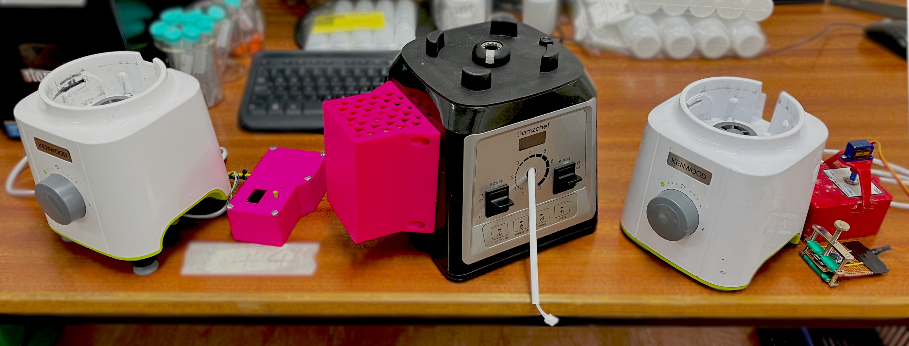

# PID Blender
_Blender with PID Speed Control, Build Notes. Part of the Open Science Framework repository [Open2DM](https://osf.io/evupy/)_

_From right to left, Dimmer-Blender v1, Dimmer-Blender v2, PID-Blender._

### Background \& Motivation

_This is part of the [Open2DM](https://osf.io/evupy/) labware project._

For my current work, I needed a blender that could be operated with good control over the exact impeller speed. Initially, I wired dimmer switch into a typical household blender, but found that it was incredibly difficult to maintain the speed accurately and repeatably, especially at low speeds (< $6000$ $rpm$). To improve performance, it was clear what was required was a system that could control the speed dynamically.

The blenders I have been controlling range between $600$ $W$ to $2$ $kW$ peak power, which they can sustain for a maximum of $\approx 1$ $min$ before they get dangerously hot (and melt-y). Some come with automatic sensors to detect when they are overheating and shut-off automatically to save the motor. From my testing, I recommend following the manufacturer's recommendations alternating running it for $1$ $min$ **ON** with a subsequent minimum of $1$ $min$ **OFF** to allow it to cool down.

### Disclaimer!

Playing with AC is _incredibly_ dangerous. Make sure to take all precautions when making modifications and ensure everything is unplugged and grounded.

## Potential Changes

List of changes and whether they have been implemented.

- [ ] The lid to the box doesnt fit the screen perfectly.
- [ ] The $60$ $rpm$ resolution is a bit of a pain at low speeds and could be rectified by switching dynamically between a time-between-counts based approach to measuring speed versus the current counts-within-time.
- [ ] The EMI produced when turning the AC on and off can wreak havoc on the onboard electronics in the box. The arduino needs better isolation from the dimmer module (probably with some well placed tin foil).
